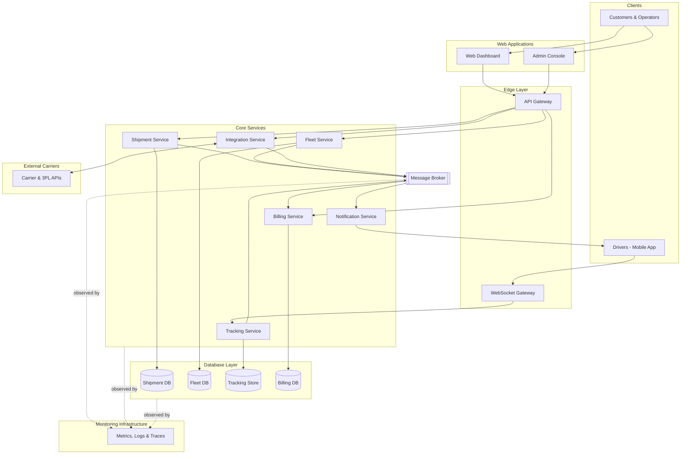

# auwalone+

**Intelligent Logistics Infrastructure for Modern Supply Chains**

auwalone+ is a B2B SaaS platform that gives logistics companies a single operating
system for managing customer accounts, shipments, fleets, and real-time delivery
visibility — from order intake to final proof of delivery.

This repository is the monorepo for the auwalone+ platform: every application,
service, shared package, and infrastructure definition that makes up the product
lives here.

---

## Table of Contents

1. [Project Vision](#project-vision)
2. [Platform Overview](#platform-overview)
3. [Monorepo Architecture](#monorepo-architecture)
4. [Architecture Vision](#architecture-vision)
5. [High-Level Architecture Diagram](#high-level-architecture-diagram)
6. [Core Domain Model](#core-domain-model)
7. [Scalability and Reliability Strategy](#scalability-and-reliability-strategy)
8. [Observability Strategy](#observability-strategy)
9. [Security Architecture](#security-architecture)
10. [Development Philosophy](#development-philosophy)
11. [Local Development Setup](#local-development-setup)
12. [Contribution Guidelines](#contribution-guidelines)
13. [Roadmap](#roadmap)

---

## Project Vision

Logistics companies run on fragmented tooling: a spreadsheet for customer accounts,
a separate system for dispatch, a carrier portal for rates and tracking numbers, and
a patchwork of phone calls and text messages to answer the one question that
actually matters — _where is this shipment right now?_ That fragmentation shows up
as missed SLAs, disputed invoices, and drivers who find out about a route change
after they've already left the yard.

auwalone+ exists to replace that fragmentation with a single, coherent platform.
It is the operating system layer for logistics companies: one place to manage
customer relationships and billing, one place to book and track shipments, one
place to see where every vehicle in the fleet is at this moment, and one set of
APIs that carriers and partners can integrate against without a bespoke project
every time a new relationship starts.

The long-term vision is for auwalone+ to become the system of record _and_ the
system of action for mid-market and enterprise logistics operators — not a
dashboard bolted on top of existing tools, but the platform their operations
actually run on. That means the platform has to be trustworthy under load, honest
about its own failure modes, and resilient enough that a regional outage doesn't
mean a fleet goes dark. Everything in this document is written with that bar in
mind, even where the corresponding capability doesn't exist yet.

## Platform Overview

auwalone+ is organized around eight capability areas that function as a single
operational ecosystem rather than as independent products:

- **Customer & Organization Management** — tenant onboarding, account hierarchies,
  user roles, and contract terms.
- **Shipment Management** — the full shipment lifecycle, from order intake through
  transit to proof of delivery.
- **Fleet Management** — vehicle registry, driver assignment, capacity planning,
  and maintenance state.
- **Real-Time Tracking** — live GPS location, ETA computation, geofencing, and
  exception detection.
- **Driver Communication** — dispatch instructions, route updates, and status
  check-ins, delivered reliably even over intermittent connectivity.
- **Carrier Integrations** — webhook-based data exchange with external carriers
  and third-party logistics providers (3PLs).
- **Reporting & Analytics** — operational KPIs, SLA compliance, billing
  reconciliation, and trend analysis.
- **Administrative Operations** — tenant configuration, access control, and
  platform-wide oversight.

None of these capabilities operate in isolation. A shipment created in the
Shipment domain triggers fleet assignment; fleet assignment activates real-time
tracking for that vehicle; tracking events feed both driver notifications and the
reporting layer; and carrier webhooks update shipment state from outside the
platform entirely. The architecture described in this document exists to make
those handoffs fast and dependable — treating the seams between domains as
first-class design concerns rather than background plumbing that only gets
attention after something breaks.

## Monorepo Architecture

auwalone+ is developed as a monorepo. Shared domain logic changes atomically with
the services that consume it, cross-cutting changes (a new field on the shipment
schema, a new auth claim) land in a single commit instead of a coordinated
multi-repo release, and one set of tooling enforces consistency across every app,
service, and package.

```
auwalone-plus/
│
├── apps/
│   ├── web-dashboard/         # Customer-facing web application
│   ├── admin-console/         # Internal admin and operations tooling
│   ├── driver-app/            # Mobile app used by drivers in the field
│   └── api-gateway/           # Public-facing API gateway and edge routing
│
├── services/
│   ├── shipment-service/      # Shipment lifecycle and order management
│   ├── fleet-service/         # Vehicle and driver registry
│   ├── tracking-service/      # Real-time GPS ingestion and location state
│   ├── notification-service/  # Driver and customer notification delivery
│   ├── billing-service/       # Invoicing, usage metering, and reconciliation
│   └── integration-service/   # Carrier webhook ingestion and normalization
│
├── packages/
│   ├── shared-types/          # Cross-service type and schema definitions
│   ├── authentication/        # Shared auth/session primitives
│   ├── logging/                # Structured logging conventions and clients
│   ├── configuration/         # Environment and config loading utilities
│   └── design-system/         # Shared UI components and design tokens
│
├── infrastructure/
│   ├── containers/            # Dockerfiles and container build configs
│   ├── kubernetes/            # Deployment manifests and Helm charts
│   ├── terraform/             # Cloud infrastructure as code
│   └── monitoring/            # Dashboards, alerting rules, SLO definitions
│
└── documentation/             # Architecture decision records and runbooks
```

**Layer responsibilities:**

- **`apps/`** — deployable, user-facing surfaces. Apps compose services and
  packages but contain no domain logic of their own; they are consumers of the
  platform, not owners of it.
- **`services/`** — independently deployable domain services, each owning its own
  datastore. No service reaches into another service's database. Cross-service
  communication happens through defined APIs or the message broker, never through
  shared tables.
- **`packages/`** — shared, versioned libraries consumed by apps and services.
  Dependencies flow one way: packages never depend on apps or services.
- **`infrastructure/`** — everything required to provision and operate the
  platform, defined as code and reviewed with the same rigor as application code.
- **`documentation/`** — architecture decision records (ADRs), operational
  runbooks, and onboarding material, kept next to the code it describes.

## Architecture Vision

The sections below describe the platform's intended target architecture — the
**architecture-to-be**. Where a capability doesn't exist yet, it's documented as a
design direction the platform is built toward, not as a claim about what's
currently implemented.

### Backend Architecture

- **Service-oriented**, with services organized around domain-driven design (DDD)
  bounded contexts — shipment, fleet, tracking, billing — rather than technical
  layers like "the database team" or "the API team."
- **API Gateway pattern** as the single entry point for client traffic, handling
  routing, authentication, rate limiting, and request/response shaping so
  individual services don't each reimplement edge concerns.
- **REST APIs** for synchronous, client-facing operations where a request expects
  an immediate, well-defined response (creating a shipment, fetching an invoice).
- **Event-driven communication** for state changes that other domains need to
  react to but don't need to block on — a shipment status change, a fleet
  assignment, a billing event.
- **Asynchronous processing** for anything that shouldn't sit in the request path:
  notification delivery, report generation, carrier webhook processing.

### Real-Time Systems

Real-time visibility is a core product requirement, not an enhancement layered on
top of a request/response API:

- **GPS location streaming** from driver devices into the tracking service at
  regular intervals, with the service maintaining current-position state per
  vehicle rather than replaying a full history on every query.
- **WebSocket communication** between the tracking service and connected clients
  (dashboards, admin console) so location updates and status changes reach the UI
  without polling.
- **Real-time shipment visibility**, computed by joining live vehicle position
  against the shipment's planned route to surface ETA and exception state (a
  vehicle stopped for longer than expected, a route deviation).
- **Driver status updates** — arrival, departure, delivery confirmation — treated
  as first-class real-time events, not just log entries reviewed after the fact.

### Messaging Infrastructure

Cross-domain communication and background work run through a message broker
rather than direct service-to-service calls:

- **Message queues** decouple producers (shipment service emitting a status
  change) from consumers (notification service, billing service) so a slow or
  unavailable consumer doesn't block the producer.
- **Event brokers** distribute domain events to every service that needs to react
  to them, without the producing service needing to know who's listening.
- **Background processing** for work that's asynchronous by nature: notification
  delivery, report generation, carrier data reconciliation.
- **Retry mechanisms** with exponential backoff for transient failures, so a
  momentary downstream outage doesn't result in dropped messages.
- **Dead-letter queues** to capture messages that fail processing after retries
  are exhausted, so failures are inspectable and replayable instead of silently
  discarded.

### External Integrations

Carrier and 3PL integrations are treated as an unreliable-network problem, not a
one-time data mapping exercise:

- **Carrier APIs** for outbound requests — creating a shipment with a carrier,
  requesting a rate quote.
- **Webhooks** for inbound events — a carrier notifying auwalone+ of a status
  change, a delivery exception, or a rate update.
- **Third-party logistics provider (3PL) support**, normalizing each carrier's
  data model into a single internal shipment representation so downstream
  services don't need to know which carrier a shipment came from.
- **Integration reliability patterns**: signature verification on inbound
  webhooks, idempotency keys so retried webhook deliveries don't create duplicate
  state, and circuit breakers around carrier APIs that are degraded or down.

## High-Level Architecture Diagram



## Core Domain Model

Each domain below is intended to have a clearly owning service, its own datastore,
and a defined contract for how other domains interact with it — either through a
synchronous API or through published events.

- **Identity & Access Management** — authentication, authorization, and the
  permission model that spans every other domain.
- **Customers & Organizations** — tenant accounts, organizational hierarchy, and
  contract-level configuration.
- **Shipments & Orders** — the shipment lifecycle, from creation through
  fulfillment.
- **Fleet & Drivers** — vehicle registry, driver records, and assignment logic.
- **Tracking** — live position state and computed visibility (ETA, exceptions).
- **Billing** — invoicing, usage metering, and reconciliation against shipment and
  contract data.
- **Notifications** — outbound communication to drivers and customers across
  channels.
- **Integrations** — the boundary between auwalone+ and external carrier systems.
- **Reporting** — cross-domain analytics and operational dashboards.

Ownership boundaries matter as much as the domains themselves: a service that
needs data from another domain asks for it through that domain's API or
subscribes to its events. It does not read that domain's tables directly. This is
what keeps the platform able to evolve one domain at a time instead of requiring
coordinated changes across the whole system.

## Scalability and Reliability Strategy

auwalone+ is being built toward reliability requirements that go beyond "keep the
servers running":

- **Horizontal scaling** for stateless services, so load is handled by adding
  instances rather than larger machines.
- **Multi-region architecture**, with the platform ultimately deployed across more
  than one geographic region so a regional outage doesn't take down the whole
  platform.
- **Availability zones** within each region, so infrastructure failures at the
  rack or data-center level don't cause a regional outage.
- **Database replication**, both within a region for failover and across regions
  for disaster recovery.
- **Disaster recovery** planning with defined recovery point objectives (RPO) and
  recovery time objectives (RTO) per domain, since billing data and live tracking
  data don't have the same tolerance for loss or downtime.
- **Backup strategies** that are tested by restoring, not just by confirming a
  backup job completed.
- **Failover planning**, including which domains can degrade gracefully (reporting
  can lag) versus which cannot (tracking and notifications need to keep working
  during a partial outage).
- **Chaos engineering** — deliberately injecting failures (killing service
  instances, introducing network latency, simulating a broker outage) in
  non-production and eventually production environments to verify the system
  fails the way it's designed to, rather than assuming it does.
- **Resilience testing** as a recurring practice, not a one-time exercise before a
  big launch.

## Observability Strategy

The platform is designed on the assumption that distributed systems fail in ways
that are only visible if you're looking for them:

- **Centralized logging** — structured logs from every service aggregated into a
  single searchable system, correlated by request and trace identifiers.
- **Metrics** — service-level and business-level metrics (request latency, queue
  depth, shipments created per hour) tracked over time and used to define SLOs.
- **Distributed tracing** — request flows followed across service boundaries, so a
  slow shipment creation can be traced from the API gateway through every service
  and queue it touches.
- **Alerting** tied to SLOs rather than raw thresholds, so alerts represent
  meaningful degradation rather than noise.
- **Performance monitoring** for both infrastructure (CPU, memory, queue depth)
  and application-level performance (API latency percentiles, WebSocket
  connection health).
- **Audit trails** for security- and compliance-relevant actions — who accessed
  what customer data, who changed a billing record — kept separately from
  general application logs and treated as immutable.

Specific tooling is intentionally left open at this stage; the requirement is the
capability, not a particular vendor.

## Security Architecture

- **Authentication** for all human and service-to-service access, with no
  implicit trust between internal services.
- **Authorization** enforced at the service layer, not just at the gateway, so a
  compromised or misconfigured client can't bypass access rules by calling a
  service directly.
- **Role-based access control (RBAC)**, scoped per organization, so permissions
  are meaningful within a tenant's own account structure.
- **Tenant isolation** as a first-class requirement given the multi-tenant nature
  of the platform — one customer's data must never be reachable through another
  customer's session, even under application-level bugs.
- **Encryption** in transit for all service and client communication, and at rest
  for stored data, particularly customer, billing, and tracking data.
- **Secrets management** through a dedicated secrets store rather than
  environment files or configuration checked into source control.
- **API security** including rate limiting, input validation, and webhook
  signature verification for inbound carrier events.
- **Compliance readiness** — the architecture is designed so that meeting
  frameworks like SOC 2 is a matter of documenting existing controls, not
  retrofitting them.

## Development Philosophy

- **Clean architecture** — domain logic is independent of frameworks, transport
  mechanisms, and databases, so those can change without rewriting business
  rules.
- **Domain-driven design** — code structure mirrors the business domains it
  represents, and bounded contexts map to service boundaries.
- **Automated testing** as the primary safety net for change, across unit,
  integration, and contract-level tests between services.
- **Continuous delivery** — small, frequent, reversible deployments rather than
  large infrequent releases.
- **Infrastructure as code** — every environment is reproducible from version
  control, not hand-configured.
- **Documentation-first culture** — architectural decisions are recorded as ADRs
  at the time they're made, not reconstructed later from memory.
- **Security-first development** — security review is part of the design process
  for a new service or feature, not a gate applied just before launch.

## Local Development Setup

> This section describes the intended local development experience. Commands and
> exact tooling versions will be added as the corresponding services and
> infrastructure are implemented.

**Required tools (planned):**

- A container runtime (for running services and their dependencies locally)
- A local orchestration tool for running multiple services together
- A package manager appropriate to each service's language/runtime
- Access credentials for shared local development infrastructure (message broker,
  databases), provisioned through the team's onboarding process

**Environment configuration:**

Each service and app will read configuration from environment-specific files
managed through the `packages/configuration` package, keeping local, staging, and
production configuration consistent in structure while differing in values.

**Installation (placeholder):**

```bash
# Clone the monorepo
git clone <repository-url>
cd auwalone-plus

# Install dependencies across the monorepo
<package-manager> install

# Start local infrastructure dependencies (database, message broker)
<orchestration-tool> up -d

# Run a specific service locally
<package-manager> --filter shipment-service dev
```

**Running services locally:**

The intent is for any service to be runnable in isolation against its own local
datastore, with its dependencies on other services either mocked or run alongside
it via local orchestration — so a developer working on the tracking service
doesn't need the entire platform running to make progress.

## Contribution Guidelines

- **Branch strategy** — feature branches cut from `main`, named descriptively
  (`shipment-service/add-partial-delivery-status`), merged via pull request. No
  direct commits to `main`.
- **Pull requests** — scoped to a single logical change, with a description that
  explains the reasoning, not just the diff. Large changes are broken into a
  sequence of reviewable PRs rather than submitted as one.
- **Code review standards** — every PR requires review from at least one engineer
  familiar with the affected domain. Reviewers are expected to engage with
  correctness and design, not just style.
- **Testing requirements** — new logic ships with tests. Changes to a service's
  public contract (API shape, published event schema) require an accompanying
  update to any contract tests that depend on it.
- **Documentation requirements** — changes that affect architecture, a service's
  public contract, or an operational runbook are accompanied by an update to
  `documentation/`, including a new ADR where a real design decision was made.

## Roadmap

**Phase 1 — Foundation**

- Core shipment management
- Authentication and organization/account structure
- Basic REST APIs for shipment and fleet data

**Phase 2 — Real-Time Operations**

- Real-time GPS tracking over WebSockets
- Driver notification delivery through the message broker
- Carrier webhook integrations

**Phase 3 — Scale & Insight**

- Reporting and analytics
- Billing and reconciliation maturity
- Admin console and platform-wide operational tooling

**Phase 4 — Resilience at Scale**

- Multi-region deployment
- Disaster recovery and tested failover
- Chaos engineering as a recurring practice, not a one-time exercise
